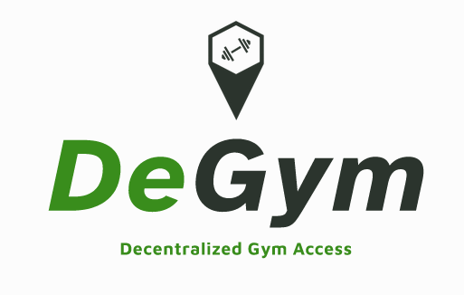

# Decentralized Gym Access

This project is a decentralized application for managing gym access and rewards using blockchain technology. Users can purchase NFTs for access, gyms stake tokens as collateral, and various rewards systems are implemented.

## Features

- NFT-based gym access
- Token staking for gyms
- Check-in system with rewards
- Incentive mechanisms for users and gyms
- Blacklist system for gyms
- Dynamic pricing for NFT access
- Wellness programs for additional rewards

## Contracts

- **GymAccessNFT**: Handles NFT minting for gym access.
- **GymStaking**: Manages staking of tokens by gyms.
- **GymCheckIn**: Handles user check-ins and rewards.
- **DynamicPricing**: Calculates dynamic pricing for NFT access.
- **WellnessProgram**: Manages health and wellness programs for users.

## UML Diagrams

The UML diagrams are divided into different files for better understanding:

- [Main UML Diagram](./diagrams/main_uml.md)
- [Dynamic Pricing UML Diagram](./diagrams/dynamic_pricing_uml.md)
- [Wellness Program UML Diagram](./diagrams/wellness_program_uml.md)

## Setup

1. Clone the repository
2. Install dependencies: `pip install eth-brownie`
3. Compile contracts: `brownie compile`
4. Deploy contracts: `brownie run scripts/deploy.py`
5. Run tests: `brownie test`

## License

This project is licensed under the MIT License.
