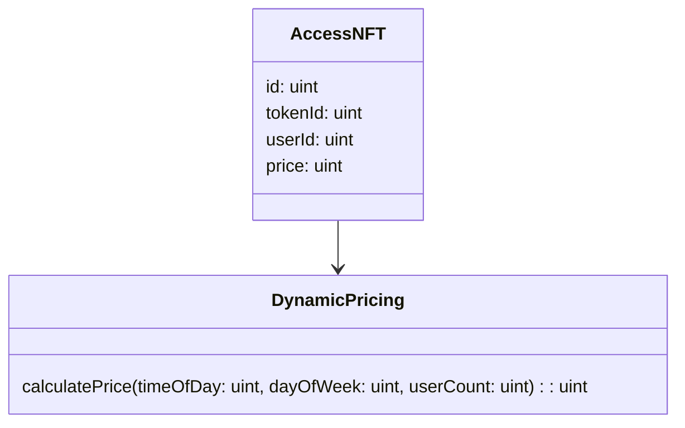

## Dynamic Pricing UML Diagram

```mermaid
classDiagram
    class AccessNFT {
        id: uint
        tokenId: uint
        userId: uint
        price: uint
    }

    class DynamicPricing {
        calculatePrice(timeOfDay: uint, dayOfWeek: uint, userCount: uint): uint
    }

    AccessNFT --> DynamicPricing
```
