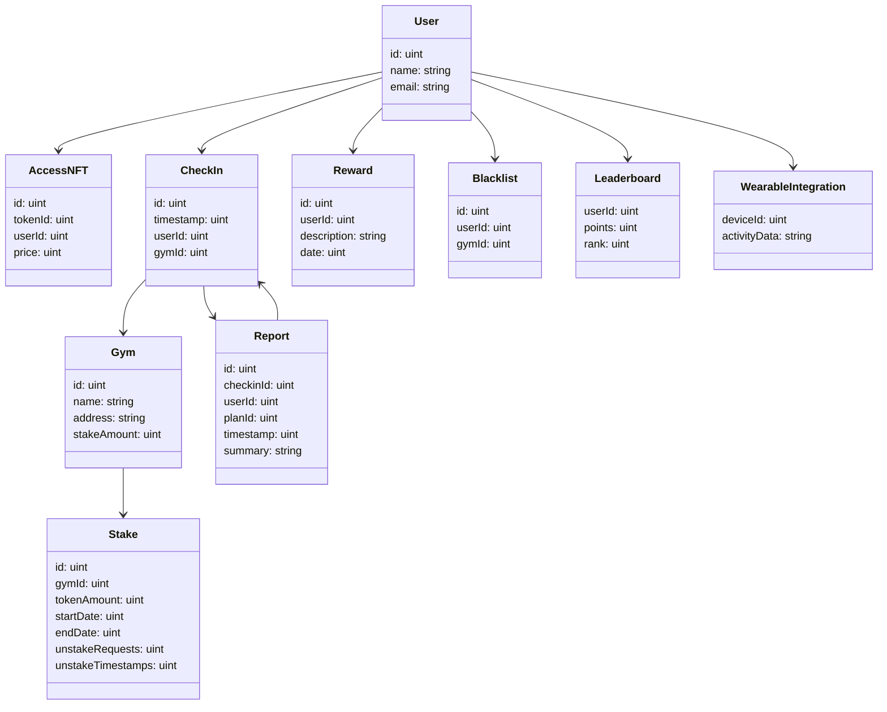

## Main UML Diagram

```mermaid
classDiagram
    class User {
        id: uint
        name: string
        email: string
    }

    class AccessNFT {
        id: uint
        tokenId: uint
        userId: uint
        price: uint
    }

    class CheckIn {
        id: uint
        timestamp: uint
        userId: uint
        gymId: uint
    }

    class Gym {
        id: uint
        name: string
        address: string
        stakeAmount: uint
    }

    class Reward {
        id: uint
        userId: uint
        description: string
        date: uint
    }

    class Stake {
        id: uint
        gymId: uint
        tokenAmount: uint
        startDate: uint
        endDate: uint
        unstakeRequests: uint
        unstakeTimestamps: uint
    }

    class Report {
        id: uint
        checkinId: uint
        userId: uint
        planId: uint
        timestamp: uint
        summary: string
    }

    class Blacklist {
        id: uint
        userId: uint
        gymId: uint
    }

    class Leaderboard {
        userId: uint
        points: uint
        rank: uint
    }

    class WearableIntegration {
        deviceId: uint
        activityData: string
    }

    User --> AccessNFT
    User --> CheckIn
    User --> Reward
    User --> Blacklist
    CheckIn --> Gym
    Gym --> Stake
    CheckIn --> Report
    Report --> CheckIn
    User --> Leaderboard
    User --> WearableIntegration

```