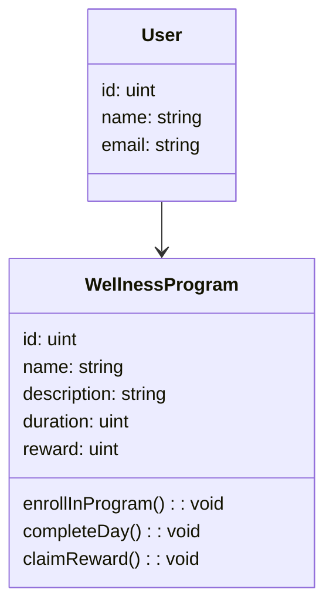

## Wellness Program UML Diagram

```mermaid
classDiagram
    class User {
        id: uint
        name: string
        email: string
    }

    class WellnessProgram {
        id: uint
        name: string
        description: string
        duration: uint
        reward: uint
        enrollInProgram(): void
        completeDay(): void
        claimReward(): void
    }

    User --> WellnessProgram
```
