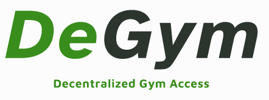

# DeGym Brand Book

## Mission Statement
To revolutionize fitness by providing seamless and decentralized access to gyms worldwide, empowering individuals to achieve their health and wellness goals anytime, anywhere.

## Vision Statement
To create a world where fitness is universally accessible, eliminating barriers and fostering a global community of health-conscious individuals.

## Taglines
1. "Unlock Fitness Freedom"
2. "Gym Access, Redefined"
3. "Fitness Without Borders"
4. "Your Gym, Everywhere"
5. "Seamless Gym Access"
6. "Fitness Unleashed"
7. "Access Anytime, Anywhere"
8. "Empowering Your Fitness Journey"
9. "The World is Your Gym"
10. "Decentralize Your Workout"

## Core Values
1. **Accessibility**: Making fitness facilities accessible to everyone, everywhere.
2. **Innovation**: Continuously improving and innovating to provide the best user experience.
3. **Community**: Fostering a global community of fitness enthusiasts.
4. **Flexibility**: Offering flexible solutions to meet diverse fitness needs.
5. **Empowerment**: Empowering individuals to take control of their fitness journey.
6. **Integrity**: Maintaining transparency and honesty in all operations.
7. **Excellence**: Striving for excellence in every aspect of our service.

## Brand Voice
DeGym’s brand voice is empowering, inclusive, and innovative. It communicates a sense of freedom and accessibility, encouraging users to take control of their fitness journey. The tone is friendly, supportive, and motivational, reflecting a commitment to helping users achieve their health goals.

## Brand Narrative
In a world where access to fitness facilities can be limited by location and time, DeGym emerges as a revolutionary platform breaking down these barriers. By leveraging the power of decentralization, DeGym provides users with the freedom to access gyms and fitness centers worldwide, anytime they choose. Our mission is to make fitness universally accessible, empowering individuals to live healthier, happier lives. Through innovation and community-building, DeGym is redefining the fitness landscape, creating a global network of accessible, high-quality gym facilities. Join us in this movement towards fitness without borders, and unlock the potential of your fitness journey with DeGym.

## Visual Identity

### Logo

### Color Palette
- **Green**: #4CAF50
- **Dark Green**: #388E3C
- **Light Green**: #C8E6C9
- **Gray**: #424242
- **White**: #FFFFFF

### Typography
- **Primary Font**: Montserrat (Bold for headlines, Regular for body text)
- **Secondary Font**: Open Sans

### Photography Style
DeGym’s photography style should reflect the brand’s core values of accessibility, empowerment, and community. The images should be hyper-realistic, vibrant, and dynamic, capturing the energy and diversity of gym-goers around the world. The focus should be on real people in real gym environments, showcasing a variety of fitness activities and facilities. The imagery should evoke a sense of freedom and inclusivity, highlighting the seamless and flexible nature of DeGym’s service.

