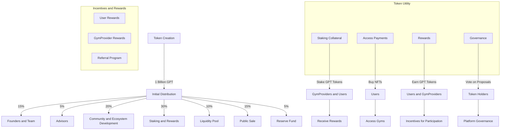

# $DGYM Tokenomics

DeGym Network issues $DGYM token as a cornerstone of governance and representation of rights in the ecosystem, allowing $DGYM community holders, founding team, and committee to jointly develop, vote, decide, and manage DeGym Network. 

**Get $DGYM on HerbSwap, and others.**

$DGYM is the governance and non-refundable functional utility token of DeGym Network. The maximum supply of $DGYM is {XXX} million, issued on Ethereum (ERC20) and Taraxa (ERC20), with 50% allocated for incentivizing community builders, ecosystem partners, and other contributors. Focused on community governance, fee discounts, stake rights, and community incentives, it aims to foster a thriving ecosystem for DeGym Network, driving its long-term growth and decentralization. Representing the rights within the DeGym ecosystem, $DGYM links users, developers, partners, and all stakeholders. $DGYM can be utilized for payments, incentives, pledges, and governance.

**Governance**: DGYM token holders can vote on network governance decisions on DeGym Network.

**Utility**: DGYM token can be used in DeGym Network ecosystem services as DeGym DApp, DaaS(DID-as-a-Service), Subscription & Notification Hub, Targeted Marketing and etc.

**Incentive**: DGYM token can be used to incentivize the ecosystem contributors, including task points holders (CHECKIN2EARN), recipients of advertisements(FIDELITY2EARN) and relay nodes.

**Service Fees**: DeGym Network uses DGYM to pay for transaction & NFT trading fees.

**Relay Node**: DGYM holders have the option to stake DGYM to run their own relay node to secure the network.

## Token Info

Token Ticker: $DGYM

Total Supply: {XXX}M

Token Contract Standard: ERC20

Token Contract Address: 0x...

## Token Distribution

Initial Distribution Plan:
- Founders And Team: 15%
  - Vesting period: 4 years with a 1-year cliff.
- Advisors: 5%
  - Vesting period: 2 years
- Community and Ecosystem Development: 20%
  - Incentives for early users, marketing campaings, and partnerships.
- Staking and Rewards: 30%
  - Reserved for user and gym provider staking rewards
- Liquidity Pool: 10%
  - To provide liquidity on decentralized exchanges.
- Public Sale: 15%
  - Token sale to raise initial funds.
- Reserve Fund: 5%
  - For unforeseen circumstances and future needs.

## Token Utility
1. Staking Collateral:
   - GymProviders must stake DGYM tokens as collateral to ensure their credibility.
   - Users can stake DGYM tokens to gain premium access to gyms.

2. Access Payments:
   - Users can purchase NFTs for pay-per-access or monthly access using DGYM tokens.

3. Rewards:
   - Users and GymProviders earn DGYM tokens as rewards for participation and maintaining system integrity.
  
4. Incentives and Rewards:
   - For Users:
     1. Staking Rewards:
       - Users who stake DGYM tokens for premium access receive additional tokens as rewards.
       - Example: 5% annual staking reward.

     2. Usage Rewards:
       - Users receive DGYM tokens for regular use of the platform (booking sessions, attending gyms).

   - For Gym Providers:
     1. Staking Rewards:
        - GymProviders who stake tokens receive additional DGYM tokens as rewards.
        - Example: 5% annual staking reward.
     2. Activity Rewards:
        - Rewards for high activity and positive user feedback.

    - Referral Program:
        - Users and GymProviders can earn GPT tokens by referring new participants to the platform.

5. Governance
    - Proposals and Voting:
        - Token holders can submit proposals for changes or new features.
        - Voting power is proportional to the number of tokens held.

    - Community Involvement:
        - Regular community meetings to discuss proposals and gather feedback.

